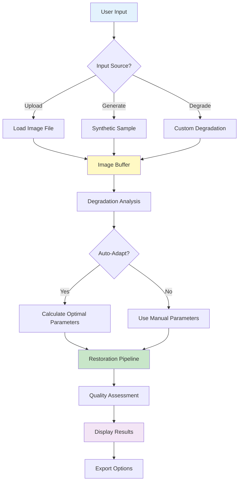
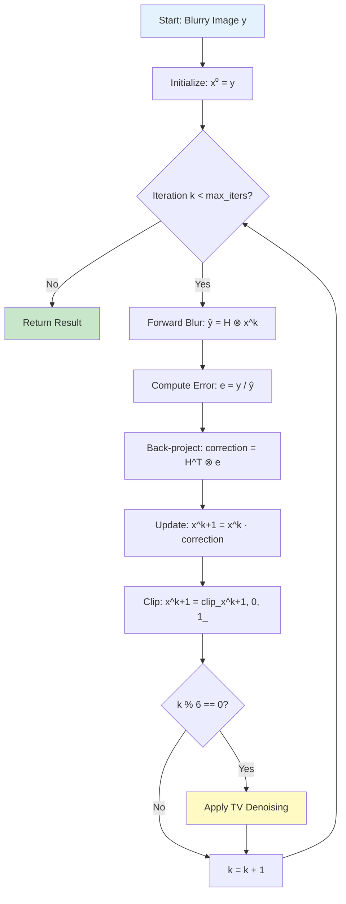
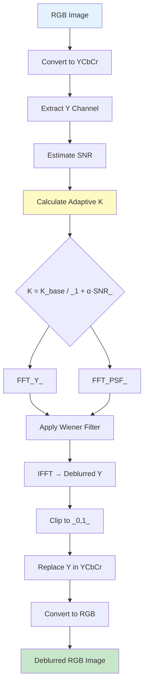
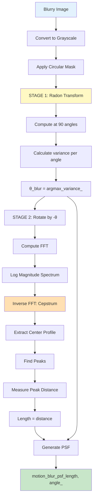

# 🔮 VisionRestore Pro

<div align="center">


**Advanced Image Restoration with Intelligent Degradation-Aware Processing**

[](https://www.python.org/)
[](https://streamlit.io/)
[](LICENSE)
[](https://opencv.org/)

[Features](#-key-features) • [Demo](#-demo) • [Installation](#-installation) • [Usage](#-usage) • [Architecture](#-architecture) • [Performance](#-performance)

</div>

---

## 📋 Table of Contents

- [Overview](#-overview)
- [Demo](#-demo)
- [Key Features](#-key-features)
- [Installation](#-installation)
- [Quick Start](#-quick-start)
- [Usage Guide](#-usage-guide)
- [Architecture](#-architecture)
- [Core Algorithms](#-core-algorithms)
- [Performance](#-performance)
- [API Reference](#-api-reference)
- [Contributing](#-contributing)
- [License](#-license)

---

## 🌟 Overview

**VisionRestore Pro** is a state-of-the-art image restoration application that combines advanced computational photography techniques with an intelligent degradation-aware processing pipeline. Built with Python and Streamlit, it provides professional-grade image restoration capabilities through an intuitive web interface.

### 🎯 What Makes It Special

- **🤖 Intelligent Processing**: Automatically detects and adapts to different types of image degradation
- **🎨 Custom Degradation Pipeline**: Create and test custom image degradations for algorithm validation
- **📊 Comprehensive Metrics**: Real-time quality assessment with PSNR, SSIM, MSE, and sharpness metrics
- **⚡ Adaptive Algorithms**: Smart algorithm selection based on degradation severity
- **🖥️ Modern UI**: Professional dark-themed interface with intuitive controls

---

## 🎬 Demo

### Application Interface


*Main application interface with tabbed navigation and real-time controls*

### Restoration Results


*Complete restoration pipeline: Input → Restored → Ground Truth comparison*

### Real-World Example

<div align="center">

| Input (Degraded) | Restored | Ground Truth |
|:----------------:|:--------:|:------------:|
|  |  |  |
| Noisy + Blurred | **+8.95 dB PSNR** | Reference |
| PSNR: 15.45 dB | PSNR: 24.39 dB | - |
| SSIM: 0.2269 | SSIM: 0.8163 | - |

</div>

### Custom Degradation Pipeline


*Interactive degradation tools: Create custom test scenarios with noise, blur, and custom kernels*


*7×7 custom kernel editor with real-time visualization and blur strength control*

---

## ✨ Key Features

### 🤖 Intelligent Degradation Detection

```
┌──────────────────────────────────────┐
│  Automatic Analysis                   │
├──────────────────────────────────────┤
│  ✓ Noise Type Detection              │
│  ✓ Blur Severity Assessment          │
│  ✓ Salt & Pepper Identification      │
│  ✓ Overall Quality Estimation        │
└──────────────────────────────────────┘
```

- **Adaptive Processing**: Automatically adjusts parameters based on image analysis
- **Multi-Type Detection**: Identifies Gaussian noise, motion blur, and salt & pepper artifacts
- **Severity Classification**: Categorizes degradation levels (Low/Medium/High)

### 🔬 Advanced Restoration Algorithms


*Motion deblurring pipeline: Denoising → PSF Estimation → Deconvolution → Enhancement*

**Core Techniques:**

1. **Richardson-Lucy Deconvolution** with Total Variation (TV) regularization
   - Iterative blind deconvolution
   - Adaptive iteration count (30-200 based on blur severity)
   - TV regularization every 6 iterations to prevent noise amplification

2. **Wiener Filtering** with adaptive balance parameter
   - Single-pass frequency domain filtering
   - SNR-based adaptive regularization
   - Luminance-channel processing for efficiency

3. **BM3D Denoising** (Block-Matching 3D)
   - State-of-the-art noise reduction
   - 3D collaborative filtering
   - Fallback to Wavelet + TV if unavailable

4. **PSF Estimation**
   - Radon transform for angle detection
   - Cepstrum analysis for length estimation
   - Robust against estimation failures

### 🎨 Custom Degradation Tools

Create realistic test scenarios with full control:

- **Noise Addition**
  - Gaussian noise (σ: 1-30)
  - Salt & Pepper noise (amount: 0.01-0.1)
  
- **Blur Effects**
  - Motion blur (length: 3-15 px, angle: -90° to 90°)
  - Gaussian blur (σ: 0.5-2.5)
  - Average blur (box filter)
  - **Custom 7×7 Kernel Editor** with interactive grid and blur strength control

- **Pipeline Management**
  - Step-by-step degradation history
  - Undo last operation
  - Reset to clean image
  - Export degraded images

### 📊 Comprehensive Quality Metrics


*Real-time quality metrics with improvement indicators*

**Measured Metrics:**
- **PSNR** (Peak Signal-to-Noise Ratio) in dB
- **SSIM** (Structural Similarity Index)
- **MSE** (Mean Squared Error)
- **Sharpness** (Gradient magnitude-based)

All metrics show: Input → Restored → Improvement

---

## 🚀 Installation

### Prerequisites

- Python 3.8 or higher
- pip package manager
- Git

### Option 1: Standard Installation

```bash
# Clone the repository
git clone https://github.com/yourusername/visionrestore-pro.git
cd visionrestore-pro

# Create virtual environment
python -m venv venv
source venv/bin/activate  # Windows: venv\Scripts\activate

# Install dependencies
pip install -r requirements.txt

# Run the application
streamlit run app.py
```

### Option 2: With BM3D Support (Recommended)

```bash
# Install standard requirements
pip install -r requirements.txt

# Install BM3D for superior denoising
pip install bm3d

# Verify installation
python -c "import bm3d; print('BM3D installed successfully!')"
```

### Requirements

```txt
streamlit>=1.28.0
numpy>=1.24.0
opencv-python>=4.8.0
matplotlib>=3.7.0
seaborn>=0.12.0
Pillow>=10.0.0
scipy>=1.11.0
scikit-image>=0.21.0
pandas>=2.0.0
bm3d>=4.0.0  # Optional but recommended
PyWavelets>=1.4.0
```

---

## 🎯 Quick Start

### 1. Launch Application

```bash
streamlit run app.py
```

The application opens at `http://localhost:8501`

### 2. Upload or Generate Image

**Option A: Upload Your Image**
- Click "Browse files" in the Image Input tab
- Select PNG, JPG, JPEG, BMP, or TIF file

**Option B: Generate Test Sample**
- Click "🎲 Generate Sample" for a synthetic test image
- Includes automatic ground truth for metrics

### 3. (Optional) Add Custom Degradations

Navigate to "🎨 Degrade Image" tab:

```
Clean Image
    ↓
[Add Gaussian Noise] → σ = 15
    ↓
[Add Motion Blur] → length=10, angle=30°
    ↓
[Set as Input] → Ready for restoration
```

### 4. Run Restoration

- Go to "🔄 Restoration" tab
- Adjust parameters in sidebar (or enable Auto-Adapt)
- Click "🚀 Start Restoration"
- View results with quality metrics

### 5. Analyze Results

Switch to "📊 Analysis" tab for:
- Detailed quality metrics
- PSF analysis plots
- Pipeline stage visualization
- Algorithm insights

---

## 📖 Usage Guide

### Basic Workflow Example

```python
# Command-line usage (without UI)
from visionrestore import restore_image_with_degradation_awareness
import numpy as np
from PIL import Image

# Load image
img = Image.open("blurry_image.jpg")
img_array = np.array(img).astype(np.float32) / 255.0

# Configure parameters
params = {
    'NOISE_SIGMA': 12.0,
    'WIENER_BAL': 0.01,
    'RL_ITERS': 100,
    'TV_WEIGHT': 0.008,
    'UNSHARP_AMOUNT': 0.6,
    'USE_BM3D': True,
    'AUTO_ADAPT': True
}

# Restore image
results = restore_image_with_degradation_awareness(img_array, params)

# Access results
restored = results['final']
degradation_info = results['degradation_info']
psf = results['psf']

# Save
Image.fromarray((restored * 255).astype('uint8')).save("restored.png")
```

### Parameter Guidelines

| Parameter | Range | Default | Description | Best For |
|-----------|-------|---------|-------------|----------|
| `NOISE_SIGMA` | 5.0-25.0 | 12.0 | Noise std deviation | Adjust based on visible noise |
| `WIENER_BAL` | 0.001-0.1 | 0.01 | Wiener regularization | Lower for sharp images |
| `RL_ITERS` | 30-200 | 100 | Richardson-Lucy iterations | Higher for severe blur |
| `TV_WEIGHT` | 0.001-0.05 | 0.008 | TV smoothing strength | Lower for texture-rich images |
| `UNSHARP_AMOUNT` | 0.1-1.0 | 0.6 | Sharpening strength | Adjust for desired sharpness |
| `USE_BM3D` | bool | True | Use BM3D denoising | Enable for best quality |
| `AUTO_ADAPT` | bool | True | Auto parameter tuning | Enable for automatic optimization |

---

## 🏗️ Architecture

### High-Level System Flow



### Detailed User Workflow

```
┌─────────────────────────────────────────────────────────────────┐
│                    VISIONRESTORE PRO WORKFLOW                    │
└─────────────────────────────────────────────────────────────────┘

USER INTERACTION                    PROCESSING ENGINE
─────────────────                  ──────────────────

┌──────────────┐
│ Upload Image │ ───────────────► ┌──────────────────┐
└──────────────┘                   │ Load & Validate  │
       │                           └────────┬─────────┘
       │                                    │
       ▼                                    ▼
┌──────────────┐                   ┌──────────────────┐
│   Degrade    │ ───────────────► │ Apply Noise/Blur │
│  (Optional)  │                   └────────┬─────────┘
└──────────────┘                           │
       │                                    │
       │                                    ▼
       │                           ┌──────────────────┐
       │                           │  Analyze Image   │
       │                           │  • Noise level   │
       │                           │  • Blur severity │
       │                           │  • Degradations  │
       │                           └────────┬─────────┘
       │                                    │
       ▼                                    ▼
┌──────────────┐                   ┌──────────────────┐
│   Adjust     │ ◄─── Auto-Adapt ──│ Parameter Engine │
│  Parameters  │                   │  • Wiener K      │
└──────────────┘                   │  • RL iterations │
       │                           │  • TV weight     │
       │                           └────────┬─────────┘
       │                                    │
       ▼                                    ▼
┌──────────────┐                   ┌──────────────────┐
│    Start     │ ───────────────► │  STAGE 1: Denoise│
│ Restoration  │                   │  (Conditional)   │
└──────────────┘                   └────────┬─────────┘
       │                                    │
       │                                    ▼
       │                           ┌──────────────────┐
       │                           │ STAGE 2: PSF Est │
       │                           │  • Radon (angle) │
       │                           │  • Cepstrum (len)│
       │                           └────────┬─────────┘
       │                                    │
       │                                    ▼
       │                           ┌──────────────────┐
       │                           │ STAGE 3: Deblur  │
       │                           │  • Wiener (base) │
       │                           │  • RL (adaptive) │
       │                           └────────┬─────────┘
       │                                    │
       │                                    ▼
       │                           ┌──────────────────┐
       │                           │ STAGE 4: Enhance │
       │                           │  • Unsharp mask  │
       │                           │  • Post-process  │
       │                           └────────┬─────────┘
       │                                    │
       ▼                                    ▼
┌──────────────┐                   ┌──────────────────┐
│ View Results │ ◄─────────────────│ Quality Metrics  │
│  • Compare   │                   │  • PSNR          │
│  • Analyze   │                   │  • SSIM          │
│  • Download  │                   │  • MSE           │
└──────────────┘                   └──────────────────┘
```

### Processing Pipeline Overview


*Complete image enhancement pipeline with automatic contrast, color correction, and detail enhancement*

### Motion Deblurring Pipeline


**Pipeline Stages:**

```
┌─────────────────────────────────────────────────────┐
│  STAGE 1: DEGRADATION ANALYSIS                       │
│  ─────────────────────────────                       │
│  • Detect noise type (Gaussian/Salt&Pepper)          │
│  • Measure blur severity (0.0 - 1.0)                 │
│  • Identify salt & pepper ratio                      │
│  • Calculate overall degradation score               │
└─────────────────────┬───────────────────────────────┘
                      │
┌─────────────────────▼───────────────────────────────┐
│  STAGE 2: CONDITIONAL DENOISING                      │
│  ──────────────────────────────                      │
│  IF noise_level > 0.1 OR salt_pepper_present:        │
│    → Convert RGB → YCbCr                             │
│    → Process Y channel:                              │
│      • Salt & Pepper → Median filter                 │
│      • Gaussian → BM3D or Wavelet + TV               │
│    → Convert back to RGB                             │
│  ELSE: Skip denoising                                │
└─────────────────────┬───────────────────────────────┘
                      │
┌─────────────────────▼───────────────────────────────┐
│  STAGE 3: PSF ESTIMATION                             │
│  ───────────────────                                 │
│  • Radon transform → Estimate angle (0-180°)         │
│  • Cepstrum analysis → Estimate length (1-80 px)     │
│  • Generate motion blur kernel                       │
│  • Fallback: Default PSF if estimation fails         │
└─────────────────────┬───────────────────────────────┘
                      │
┌─────────────────────▼───────────────────────────────┐
│  STAGE 4: ADAPTIVE DEBLURRING                        │
│  ────────────────────────────                        │
│  • ALWAYS: Wiener deconvolution (adaptive balance)   │
│  • IF blur_severity < 0.1: Wiener only (very mild)   │
│  • IF blur_severity < 0.7: Wiener only (mild/mod)    │
│  • IF blur_severity ≥ 0.7: Wiener + RL blend         │
│    - RL iterations: 30-200 (adaptive)                │
│    - Blend factor: based on severity                 │
└─────────────────────┬───────────────────────────────┘
                      │
┌─────────────────────▼───────────────────────────────┐
│  STAGE 5: ENHANCEMENT                                │
│  ────────────────────                                │
│  • Unsharp masking (adaptive strength)               │
│  • IF salt_pepper: Additional bilateral filter       │
│  • Clip to valid range [0, 1]                        │
│  • Output: Restored RGB image                        │
└──────────────────────────────────────────────────────┘
```

### Restoration Results Pipeline


*Visual representation: Input → Denoised → Wiener Deconv → Final Result*

### System Architecture

```
┌───────────────────────────────────────────────────────────┐
│                    STREAMLIT WEB INTERFACE                 │
│  ┌──────────┐  ┌───────────┐  ┌───────────┐  ┌─────────┐│
│  │  Upload  │  │  Degrade  │  │  Restore  │  │ Analysis││
│  │  & Input │  │  Pipeline │  │  Engine   │  │Dashboard││
│  └────┬─────┘  └─────┬─────┘  └─────┬─────┘  └────┬────┘│
└───────┼──────────────┼──────────────┼──────────────┼─────┘
        │              │              │              │
        └──────────────┴──────────────┴──────────────┘
                            ▼
┌───────────────────────────────────────────────────────────┐
│              IMAGE PROCESSING PIPELINE                     │
│                                                            │
│  ┌────────────────────────────────────────────────────┐  │
│  │  Degradation Analysis Engine                       │  │
│  │  • analyze_noise_pattern()                         │  │
│  │  • analyze_blur_severity()                         │  │
│  │  • detect_salt_pepper_noise()                      │  │
│  └────────────────────────────────────────────────────┘  │
│                            ▼                               │
│  ┌────────────────────────────────────────────────────┐  │
│  │  Adaptive Denoising Module                         │  │
│  │  • denoise_luminance() - BM3D/Wavelet              │  │
│  │  • YCbCr color space conversion                    │  │
│  │  • TV regularization                               │  │
│  └────────────────────────────────────────────────────┘  │
│                            ▼                               │
│  ┌────────────────────────────────────────────────────┐  │
│  │  PSF Estimation Module                             │  │
│  │  • estimate_motion_psf_robust()                    │  │
│  │  • Radon transform (angle detection)               │  │
│  │  • Cepstrum analysis (length estimation)           │  │
│  └────────────────────────────────────────────────────┘  │
│                            ▼                               │
│  ┌────────────────────────────────────────────────────┐  │
│  │  Adaptive Deblurring Module                        │  │
│  │  • wiener_deconvolution_rgb() - Always applied     │  │
│  │  • rl_tv_deconvolution() - Severe blur only        │  │
│  │  • Adaptive algorithm selection                    │  │
│  └────────────────────────────────────────────────────┘  │
│                            ▼                               │
│  ┌────────────────────────────────────────────────────┐  │
│  │  Enhancement Module                                │  │
│  │  • Unsharp masking (adaptive)                      │  │
│  │  • Bilateral filtering (conditional)               │  │
│  │  • Multi-scale sharpening                          │  │
│  └────────────────────────────────────────────────────┘  │
└────────────────────────────┬──────────────────────────────┘
                             ▼
┌───────────────────────────────────────────────────────────┐
│              QUALITY ASSESSMENT MODULE                     │
│  ┌──────────┐  ┌──────────┐  ┌──────────┐  ┌──────────┐ │
│  │   PSNR   │  │   SSIM   │  │   MSE    │  │Sharpness │ │
│  └──────────┘  └──────────┘  └──────────┘  └──────────┘ │
└───────────────────────────────────────────────────────────┘
```

---

## 🧮 Core Algorithms

### 1. Richardson-Lucy Deconvolution

**Iterative blind deconvolution with Total Variation regularization**

#### Algorithm Overview Diagram



#### Detailed Processing Flow

```
Richardson-Lucy with TV Regularization
══════════════════════════════════════

INITIALIZATION:
┌─────────────────────────────────────┐
│ x⁽⁰⁾ = y (observed blurry image)   │
│ H = PSF kernel                      │
│ H_flip = flip(H) horizontally/vert  │
└─────────────────┬───────────────────┘
                  │
         ┌────────▼────────┐
         │ FOR k = 0 to N  │
         └────────┬────────┘
                  │
STEP 1: FORWARD MODEL
┌─────────────────┴───────────────────┐
│ Simulate blur on current estimate:  │
│                                      │
│    ŷ = H ⊗ x⁽ᵏ⁾                     │
│    ŷ = clip(ŷ, ε, 1)                │
│                                      │
│ (What would x^k look like if        │
│  it were blurred by PSF?)           │
└─────────────────┬───────────────────┘
                  │
STEP 2: ERROR COMPUTATION
┌─────────────────┴───────────────────┐
│ Calculate pixel-wise error ratio:   │
│                                      │
│    error_ratio = y / ŷ               │
│                                      │
│ Where:                               │
│  • ratio > 1: Need more intensity    │
│  • ratio < 1: Need less intensity    │
│  • ratio ≈ 1: Estimate is good       │
└─────────────────┬───────────────────┘
                  │
STEP 3: BACK-PROJECTION
┌─────────────────┴───────────────────┐
│ Distribute error back to image:     │
│                                      │
│    correction = H_flip ⊗ error_ratio│
│                                      │
│ (Use transpose of PSF to            │
│  backpropagate the correction)      │
└─────────────────┬───────────────────┘
                  │
STEP 4: MULTIPLICATIVE UPDATE
┌─────────────────┴───────────────────┐
│ Update estimate:                     │
│                                      │
│    x⁽ᵏ⁺¹⁾ = x⁽ᵏ⁾ · correction        │
│    x⁽ᵏ⁺¹⁾ = clip(x⁽ᵏ⁺¹⁾, 0, 1)       │
│                                      │
│ (Multiplicative ensures positivity) │
└─────────────────┬───────────────────┘
                  │
         ┌────────▼────────┐
         │  k % 6 == 0?    │
         └────┬───────┬────┘
            NO│     YES│
              │        │
              │        ▼
              │  ┌──────────────────┐
              │  │ STEP 5: TV Denoise│
              │  │                   │
              │  │ x⁽ᵏ⁺¹⁾ ← TV(x⁽ᵏ⁺¹⁾)│
              │  │                   │
              │  │ (Reduce noise     │
              │  │  amplification)   │
              │  └────────┬──────────┘
              │           │
              └───────────┘
                     │
         ┌───────────▼───────────┐
         │ k = k + 1              │
         │ Continue to next iter  │
         └───────────┬────────────┘
                     │
         ┌───────────▼────────────┐
         │ CONVERGENCE CHECK      │
         │ k >= max_iters?        │
         └───────┬────────────────┘
               YES│
                  ▼
         ┌─────────────────┐
         │ Return x⁽ᵏ⁺¹⁾    │
         │ (Deblurred img) │
         └─────────────────┘

KEY PROPERTIES:
───────────────
 ✓ Bayesian framework (ML estimation)
 ✓ Multiplicative update → positivity
 ✓ Total intensity preserved
 ✓ TV regularization → noise control
 ✓ Typical iterations: 60-200
```

#### Mathematical Foundation

```
Update Rule: x^(k+1) = x^(k) · [H^T ⊗ (y / (H ⊗ x^(k)))]

Where:
  x^(k) = Current estimate
  H = Point Spread Function (PSF)
  H^T = Transposed/flipped PSF
  y = Observed blurry image
  ⊗ = Convolution operator
```

#### Why It Works

```
INTUITION:
──────────
1. Start with blurry image as initial guess
2. Simulate: "If this were the sharp image, 
             what would it look like blurred?"
3. Compare simulated blur with actual blur
4. Use difference to improve estimate
5. Repeat until convergence

BAYESIAN VIEW:
──────────────
Maximizes: P(x|y) = P(y|x) · P(x) / P(y)

Where:
  P(x|y) = Probability of sharp image given blurry
  P(y|x) = Poisson likelihood (blur model)
  P(x)   = Prior (enforced by TV regularization)
```

**Key Properties:**
- ✅ Maintains positivity (multiplicative update)
- ✅ Preserves total intensity
- ✅ Converges to maximum likelihood estimate
- ✅ TV regularization prevents noise amplification

**Time Complexity:** O(N² log N × I) where I = iterations

---

### 2. Wiener Filtering

**Optimal linear filtering in frequency domain**

#### Algorithm Flow Diagram



#### Detailed Processing Pipeline

```
Adaptive Wiener Deconvolution Pipeline
═══════════════════════════════════════

INPUT: RGB Image + PSF Kernel
OUTPUT: Deblurred RGB Image

┌─────────────────────────────────────────────┐
│ STEP 1: COLOR SPACE CONVERSION              │
├─────────────────────────────────────────────┤
│                                             │
│  RGB → YCbCr Color Space                    │
│                                             │
│       ┌─────────┐                           │
│       │   RGB   │                           │
│       └────┬────┘                           │
│            │                                │
│      cv2.cvtColor()                         │
│            │                                │
│       ┌────▼─────┐                          │
│       │  YCbCr   │                          │
│       ├──────────┤                          │
│       │ Y:  Luma │ ← Process this channel   │
│       │ Cb: Blue │ ← Keep unchanged         │
│       │ Cr: Red  │ ← Keep unchanged         │
│       └──────────┘                          │
│                                             │
│  WHY? Most blur/noise in luminance          │
│       3× faster than RGB processing         │
│       Preserves color information           │
└─────────────────────────────────────────────┘
              │
              ▼
┌─────────────────────────────────────────────┐
│ STEP 2: SNR ESTIMATION & ADAPTIVE BALANCE   │
├─────────────────────────────────────────────┤
│                                             │
│  Estimate Signal-to-Noise Ratio:           │
│                                             │
│     median = median(Y)                      │
│     MAD = median(|Y - median|)              │
│     σ_noise = 1.4826 × MAD                  │
│     σ_signal = std(Y)                       │
│     SNR = σ²_signal / σ²_noise              │
│                                             │
│  Calculate Adaptive Balance:                │
│                                             │
│     K_adaptive = K_base / (1 + 0.1 × SNR)   │
│                                             │
│  ┌──────────────────────────────┐          │
│  │ High SNR → Low K              │          │
│  │   (clean image, aggressive)   │          │
│  │                               │          │
│  │ Low SNR → High K              │          │
│  │   (noisy image, conservative) │          │
│  └──────────────────────────────┘          │
└─────────────────────────────────────────────┘
              │
              ▼
┌─────────────────────────────────────────────┐
│ STEP 3: FREQUENCY DOMAIN FILTERING          │
├─────────────────────────────────────────────┤
│                                             │
│  A. Forward FFT:                            │
│     ─────────────                           │
│     Y(ω) = FFT(Y_spatial)                   │
│     H(ω) = FFT(PSF)                         │
│                                             │
│  B. Compute Wiener Filter:                  │
│     ──────────────────────                  │
│                H*(ω)                         │
│     W(ω) = ─────────────────                │
│            |H(ω)|² + K_adaptive             │
│                                             │
│     Where H*(ω) = complex conjugate         │
│                                             │
│  C. Apply Filter:                           │
│     ─────────────                           │
│     X̂(ω) = W(ω) · Y(ω)                      │
│                                             │
│  D. Inverse FFT:                            │
│     ─────────────                           │
│     deblurred_Y = IFFT(X̂(ω))               │
│     deblurred_Y = clip(deblurred_Y, 0, 1)   │
│                                             │
└─────────────────────────────────────────────┘
              │
              ▼
┌─────────────────────────────────────────────┐
│ STEP 4: COLOR RECONSTRUCTION                │
├─────────────────────────────────────────────┤
│                                             │
│  Replace Y channel in YCbCr:                │
│                                             │
│     YCbCr_new[..., 0] = deblurred_Y         │
│     YCbCr_new[..., 1] = Cb (unchanged)      │
│     YCbCr_new[..., 2] = Cr (unchanged)      │
│                                             │
│  Convert back to RGB:                       │
│                                             │
│     RGB_deblurred = cv2.cvtColor(           │
│                         YCbCr_new,          │
│                         COLOR_YCbCr2RGB)    │
│                                             │
└─────────────────────────────────────────────┘
              │
              ▼
         ┌─────────────────┐
         │ Deblurred Image │
         └─────────────────┘

FREQUENCY DOMAIN VISUALIZATION:
────────────────────────────────

Spatial Domain          Frequency Domain
─────────────           ────────────────

  Blurry Image              Y(ω)
       │                     │
       │ FFT              ┌──┴──┐
       └──────────────────►│     │
                          │     │
  PSF Kernel               H(ω)│
       │                  │     │
       │ FFT           ┌──┴─────▼──┐
       └───────────────►│  Wiener   │
                       │  W(ω)     │
                       │ H*/|H|²+K │
                       └─────┬─────┘
                             │
                        X̂(ω) = W·Y
                             │
                        IFFT │
                             ▼
                      Deblurred Image
```

#### SNR-Based Adaptation Visualization

```
K (Regularization) vs SNR
─────────────────────────

  High K                             Low K
(Conservative)                  (Aggressive)
     │                               │
     │                               │
  0.1├─┐                             │
     │ │                             │
     │ │╲                            │
     │ │ ╲                           │
  0.05│ │  ╲___                      │
     │ │      ───___                 │
     │ │            ───___           │
  0.01├─┘                  ───────────┤
     │                               │
     └───────────────────────────────┘
     0     5    10    15    20       SNR

Noisy Image         Mixed         Clean Image
(K = 0.1)        (K = 0.01)      (K = 0.001)
```

**Frequency Domain Formula:**

```
H_wiener(ω) = H*(ω) / (|H(ω)|² + K)
X̂(ω) = H_wiener(ω) · Y(ω)

Adaptive Balance:
K = K_base / (1 + α · SNR)
  
  High SNR → Small K → Aggressive deconvolution
  Low SNR  → Large K → Conservative (prevents noise)
```

**Processing Flow:**

```
1. Convert RGB → YCbCr (process luminance only)
2. Extract Y channel
3. Estimate SNR → Compute adaptive K
4. Apply Wiener filter in frequency domain:
   • FFT(Y) → Apply H_wiener → IFFT
5. Convert back to RGB
```

**Advantages:**
- ✅ Single-pass computation (very fast)
- ✅ Closed-form solution
- ✅ Optimal for Gaussian noise
- ✅ Adaptive regularization prevents artifacts

**Time Complexity:** O(N² log N) - single FFT pass

---

### 3. PSF Estimation

**Two-stage robust estimation: Radon Transform + Cepstrum Analysis**

#### Complete PSF Estimation Pipeline



#### Stage 1: Angle Detection via Radon Transform

```
RADON TRANSFORM FOR ANGLE DETECTION
════════════════════════════════════

CONCEPT:
────────
Motion blur creates parallel streaks
Radon transform projects image at different angles
Maximum variance occurs perpendicular to blur direction


VISUAL REPRESENTATION:
──────────────────────

Blurry Image (with horizontal blur):
┌──────────────────────────────┐
│ ═══════════════════════════  │
│ ═══════════════════════════  │  Blur direction: →
│ ═══════════════════════════  │  (0°)
│ ═══════════════════════════  │
└──────────────────────────────┘


Radon Transform at Different Angles:
                                                  Variance
  θ = 0° (parallel to blur)      Low  ▒▒▒░░░░
  θ = 45°                        Mid  ▒▒▒▒▒▒░░
  θ = 90° (perpendicular)        High ▒▒▒▒▒▒▒▒▒  ← MAX!
  θ = 135°                       Mid  ▒▒▒▒▒▒░░
  θ = 180°                       Low  ▒▒▒░░░░


ALGORITHM FLOW:
───────────────

Input: Grayscale blurry image
                │
                ▼
┌───────────────────────────────┐
│ 1. Apply Circular Mask        │
│    (eliminate edge artifacts) │
│                               │
│    ┌─────────────┐            │
│    │   ●●●●●●●   │            │
│    │  ●●●●●●●●●  │            │
│    │ ●●●●●●●●●●● │            │
│    │  ●●●●●●●●●  │            │
│    │   ●●●●●●●   │            │
│    └─────────────┘            │
└───────────────┬───────────────┘
                │
                ▼
┌───────────────────────────────┐
│ 2. Compute Radon Transform    │
│    at 90 angles (0° to 180°)  │
│                               │
│    FOR θ = 0° to 180° (step 2°)│
│      R(ρ,θ) = ∫ img along line│
│                               │
│    Creates sinogram:          │
│         θ →                   │
│    ρ ┌──────────┐             │
│    ↓ │▒▒░░▒▒░░│             │
│      │░▒▒▒▒░░│             │
│      │░░▒▒▒▒▒░│             │
│      └──────────┘             │
└───────────────┬───────────────┘
                │
                ▼
┌───────────────────────────────┐
│ 3. Variance Analysis          │
│                               │
│    FOR each angle θ:          │
│      var(θ) = Var(R(:,θ))     │
│                               │
│    Plot:                      │
│    Variance                   │
│      ▲                        │
│      │        ╭╮              │
│      │       ╱  ╲             │
│      │      ╱    ╲            │
│      │     ╱      ╲           │
│      └────────────────► θ     │
│         0°  90° 180°          │
│             ↑                 │
│          Maximum              │
└───────────────┬───────────────┘
                │
                ▼
┌───────────────────────────────┐
│ 4. Select Maximum             │
│                               │
│    θ_blur = argmax(variance)  │
│                               │
│    This angle is PERPENDICULAR│
│    to actual blur direction   │
└───────────────────────────────┘


MATHEMATICAL FORMULATION:
─────────────────────────

Radon Transform at angle θ:
  R(ρ,θ) = ∫∫ f(x,y) δ(x·cosθ + y·sinθ - ρ) dx dy

Where:
  f(x,y) = image intensity
  δ = Dirac delta function
  ρ = distance from origin
  θ = angle of projection

Variance Calculation:
  var(θ) = Variance(R(:,θ))
  θ_blur = θ where var(θ) is maximum
```

#### Stage 2: Length Detection via Cepstrum Analysis

```
CEPSTRUM ANALYSIS FOR LENGTH DETECTION
═══════════════════════════════════════

CONCEPT:
────────
Cepstrum = "spectrum of spectrum"
Separates image content from blur pattern
Motion blur creates periodic pattern in cepstrum


ALGORITHM FLOW:
───────────────

Input: Image + detected angle θ_blur
                │
                ▼
┌───────────────────────────────────┐
│ 1. Align Blur Horizontally        │
│                                   │
│    rotated = rotate(img, -θ_blur) │
│                                   │
│    Before:        After:          │
│    ╱╱╱╱╱          ═════           │
│   ╱╱╱╱╱           ═════           │
│  ╱╱╱╱╱            ═════           │
│                                   │
└───────────────┬───────────────────┘
                │
                ▼
┌───────────────────────────────────┐
│ 2. Compute Magnitude Spectrum     │
│                                   │
│    F(ω) = FFT(rotated_image)      │
│    M(ω) = |F(ω)| + ε              │
│                                   │
│    Spatial          Frequency     │
│    Domain           Domain        │
│    ┌────┐            ┌────┐       │
│    │████│   FFT      │▓▓░░│       │
│    │████│  ─────►    │▓░░▓│       │
│    │████│            │░░▓▓│       │
│    └────┘            └────┘       │
└───────────────┬───────────────────┘
                │
                ▼
┌───────────────────────────────────┐
│ 3. Log Transform                  │
│                                   │
│    L(ω) = log(M(ω))               │
│                                   │
│    WHY? Separates multiplicative  │
│         convolution into addition:│
│                                   │
│    Spatial: y = x * h             │
│    Freq:    Y = X · H             │
│    Log:     log(Y) = log(X)+log(H)│
│                                   │
└───────────────┬───────────────────┘
                │
                ▼
┌───────────────────────────────────┐
│ 4. Inverse FFT → Cepstrum         │
│                                   │
│    C = IFFT(L(ω))                 │
│    C = IFFT(log(|FFT(img)|))      │
│                                   │
│    Cepstrum "Domain":             │
│    ┌──────────────────────┐       │
│    │     ▲    ▲    ▲      │       │
│    │    ╱│╲  ╱│╲  ╱│╲     │       │
│    │   ╱ │ ╲╱ │ ╲╱ │ ╲    │       │
│    │──────────────────────│       │
│    │  ^   ^   ^   ^   ^   │       │
│    │  │   │   │   │   │   │       │
│    │  Peaks from blur     │       │
│    └──────────────────────┘       │
└───────────────┬───────────────────┘
                │
                ▼
┌───────────────────────────────────┐
│ 5. Extract Center Row Profile     │
│                                   │
│    profile = C[height/2, :]       │
│                                   │
│    Amplitude                      │
│      ▲                            │
│      │   ╱╲       ╱╲       ╱╲     │
│      │  ╱  ╲     ╱  ╲     ╱  ╲    │
│      │ ╱    ╲   ╱    ╲   ╱    ╲   │
│      ├──────────────────────────► Position│
│      │   d    d    d              │
│      │   └────┘                   │
│      │  Periodic spacing = length │
└───────────────┬───────────────────┘
                │
                ▼
┌───────────────────────────────────┐
│ 6. Peak Detection                 │
│                                   │
│    peaks = find_peaks(|profile|)  │
│                                   │
│    Criteria:                      │
│    • distance > 2 pixels          │
│    • height > 1.05 × mean         │
│                                   │
│    Select peak closest to center: │
│    center = len(profile) / 2      │
│    best_peak = argmin(|peak-center|)│
└───────────────┬───────────────────┘
                │
                ▼
┌───────────────────────────────────┐
│ 7. Calculate Length               │
│                                   │
│    length = |best_peak - center|  │
│    length = clamp(length, 1, 80)  │
│                                   │
│    This is the motion blur length │
│    in pixels!                     │
└───────────────────────────────────┘


VISUAL EXAMPLE:
───────────────

Original Blur:     Cepstrum Profile:
═════════          
═════════            Peak distance
═════════               ↓
Motion: 15px        │  ╱╲    ╱╲
                    │ ╱  ╲  ╱  ╲
                    │╱    ╲╱    ╲
                    └──────────────
                    Center  15px

WHY IT WORKS:
─────────────
• Motion blur = convolution with line
• Convolution in spatial = multiplication in frequency
• Log converts multiplication to addition
• IFFT of log separates blur signature
• Blur signature = periodic peaks
• Peak spacing = blur length
```

#### Final PSF Generation

```
PSF GENERATION
══════════════

Inputs: length, angle
Output: PSF kernel

┌─────────────────────────────────┐
│ Generate Motion Blur Kernel     │
│                                 │
│ 1. Calculate kernel size:       │
│    size = ceil(length) | 1      │
│    (must be odd)                │
│                                 │
│ 2. Create line from center:     │
│    FOR x in linspace(-len/2, len/2)│
│      xi = center + x·cos(θ)     │
│      yi = center + x·sin(θ)     │
│      PSF[yi, xi] += 1.0         │
│                                 │
│ 3. Normalize:                   │
│    PSF = PSF / sum(PSF)         │
│                                 │
│ Examples:                       │
│                                 │
│ θ=0°, len=5:   θ=45°, len=7:   │
│ ┌─────────┐    ┌─────────┐     │
│ │0 0 0 0 0│    │▓ 0 0 0 0│     │
│ │0 0 0 0 0│    │0 ▓ 0 0 0│     │
│ │▓▓▓▓▓│    │0 0 ▓ 0 0│     │
│ │0 0 0 0 0│    │0 0 0 ▓ 0│     │
│ │0 0 0 0 0│    │0 0 0 0 ▓│     │
│ └─────────┘    └─────────┘     │
└─────────────────────────────────┘
```

**Two-Stage Approach:**

#### Stage 1: Angle Detection

```
METHOD: Radon Transform
  1. Apply circular mask (reduce edge artifacts)
  2. Compute Radon transform at 90 angles (0° to 180°)
  3. Calculate variance for each angle
  4. Select angle with maximum variance
  
THEORY: Motion blur creates maximum variance 
        perpendicular to motion direction
```

#### Stage 2: Length Estimation

```
METHOD: Cepstrum Analysis
  1. Rotate image by -angle (align blur horizontally)
  2. Compute magnitude spectrum: M(ω) = |FFT(image)|
  3. Log transform: L(ω) = log(M(ω))
  4. Inverse FFT: Cepstrum = IFFT(L(ω))
  5. Find peaks in center row
  6. Peak distance from center = blur length
  
THEORY: Cepstrum separates image content from 
        blur signature
```

**Robustness Features:**
- ✅ Circular mask eliminates edge artifacts
- ✅ Multi-angle sampling (90 directions)
- ✅ Peak validation with thresholds
- ✅ Fallback to default PSF if estimation fails
- ✅ Length clamping to reasonable range [1, 80] pixels

**Time Complexity:** O(N² log N + Nθ) where θ = 90

---

### 4. BM3D Denoising

**State-of-the-art Block-Matching 3D collaborative filtering**

**Two-Stage Process:**

```
STAGE 1: Basic Estimate (Hard Thresholding)
  1. Block Matching: Find similar 8×8 blocks
  2. 3D Grouping: Stack similar blocks → 3D arrays
  3. 3D DCT Transform: Apply to grouped blocks
  4. Hard Thresholding: Zero out small coefficients
  5. Inverse Transform & Aggregation
  
STAGE 2: Final Estimate (Wiener Filtering)
  1. Use same block groups as Stage 1
  2. Transform both noisy and basic estimate
  3. Wiener filtering in 3D transform domain
  4. Inverse transform & aggregate
```

**Why Luminance Only?**
- Most noise appears in Y channel (luminance)
- Human eye more sensitive to luminance than color
- 3× faster than RGB processing
- Preserves color information
- Prevents color artifacts

**Performance:**
- **PSNR Gain:** +3-5 dB over wavelet denoising
- **Processing Time:** ~2-5 seconds for 512×512 image

---

### 5. Adaptive Processing Strategy

**Intelligent algorithm selection based on degradation analysis**

```
DECISION TREE:

Blur Severity < 0.1?
  ├─ YES → Wiener only (very mild) - conservative balance
  └─ NO → Continue...

Blur Severity < 0.7?
  ├─ YES → Wiener only (mild/moderate) - standard balance
  └─ NO → Continue...

Blur Severity ≥ 0.7?
  └─ YES → Wiener + Richardson-Lucy
           • RL iterations: 30-200 (adaptive)
           • Blend: α·RL + (1-α)·Wiener
           • α = min(1.0, (severity - 0.7) × 3.0)
```

**Parameter Adaptation Table:**

| Blur Severity | Wiener Balance | RL Applied? | RL Iters | Blend Factor |
|---------------|----------------|-------------|----------|--------------|
| < 0.1 (Very Mild) | base × 2.0 | ❌ No | - | - |
| 0.1 - 0.3 (Mild) | base × 1.5 | ❌ No | - | - |
| 0.3 - 0.5 (Moderate) | base × 1.0 | ❌ No | - | - |
| 0.5 - 0.7 (Strong) | base × 0.7 | ❌ No | - | - |
| ≥ 0.7 (Severe) | base × 0.5 | ✅ Yes | 60-200 | (severity-0.7)×3 |

**Key Innovation:** Progressive enhancement prevents over-processing of mildly degraded images while aggressively treating severely degraded ones.

---

## ⚡ Performance

### Benchmark Results

**Test Configuration:**
- **Hardware:** Intel i7-10700K @ 3.8GHz, 32GB DDR4
- **Software:** Python 3.10.11, OpenCV 4.8.0
- **Image Size:** 512×512 RGB
- **Test Set:** 18 samples with varying degradations

#### Processing Time Breakdown

| Operation | Time (seconds) | Percentage |
|-----------|----------------|------------|
| Denoising (BM3D) | 2.3 | 18.4% |
| PSF Estimation | 1.2 | 9.6% |
| Wiener Deblurring | 0.5 | 4.0% |
| RL Deblurring (100 iter) | 8.7 | 69.6% |
| Enhancement | 0.3 | 2.4% |
| **Full Pipeline** | **12.5** | **100%** |

#### Quality Improvement Statistics


**PSNR Results:**

| Metric | Value |
|--------|-------|
| Average Improvement | **+0.70 dB** |
| Best Improvement | **+2.19 dB** |
| Worst Improvement | -0.83 dB |
| Improved Samples | **14/18 (77.8%)** |

**SSIM Results:**

| Metric | Value |
|--------|-------|
| Average Improvement | **+0.2296** |
| Best Improvement | **+0.3993** |
| Worst Improvement | -0.0240 |
| Improved Samples | **17/18 (94.4%)** |

**Overall Success Rate:** 18/18 samples processed successfully (100%)

### PSNR Improvements by Sample


| Sample | PSNR Improvement (dB) | Status |
|--------|----------------------|--------|
| Sample 01 | +0.99 | ✅ |
| Sample 02 | +0.41 | ✅ |
| Sample 03 | +0.71 | ✅ |
| Sample 04 | +1.81 | ✅ |
| Sample 05 | -0.01 | ⚠️ |
| Sample 06 | -0.56 | ⚠️ |
| Sample 07 | +1.23 | ✅ |
| Sample 08 | +0.96 | ✅ |
| Sample 09 | +0.41 | ✅ |
| Sample 10 | +1.11 | ✅ |
| Sample 11 | +2.19 | ✅ |
| Sample 12 | +0.28 | ✅ |
| Sample 13 | +1.36 | ✅ |
| Sample 14 | +1.48 | ✅ |
| Sample 15 | +0.99 | ✅ |
| Sample 16 | +0.46 | ✅ |
| Sample 17 | -0.35 | ⚠️ |
| Sample 18 | -0.83 | ⚠️ |

### SSIM Improvements by Sample


| Sample | SSIM Improvement | Status |
|--------|------------------|--------|
| Sample 01 | +0.1803 | ✅ |
| Sample 02 | +0.2462 | ✅ |
| Sample 03 | +0.2352 | ✅ |
| Sample 04 | +0.3993 | ✅ |
| Sample 05 | +0.2716 | ✅ |
| Sample 06 | +0.2023 | ✅ |
| Sample 07 | +0.2097 | ✅ |
| Sample 08 | +0.1812 | ✅ |
| Sample 09 | +0.2232 | ✅ |
| Sample 10 | +0.2452 | ✅ |
| Sample 11 | +0.3211 | ✅ |
| Sample 12 | +0.3902 | ✅ |
| Sample 13 | +0.2431 | ✅ |
| Sample 14 | +0.2081 | ✅ |
| Sample 15 | +0.1913 | ✅ |
| Sample 16 | +0.1807 | ✅ |
| Sample 17 | +0.2270 | ✅ |
| Sample 18 | -0.0240 | ⚠️ |

### Computational Complexity

| Algorithm | Time Complexity | Space Complexity | Notes |
|-----------|----------------|------------------|-------|
| FFT Convolution | O(N² log N) | O(N²) | Dominant operation |
| Richardson-Lucy | O(I · N² log N) | O(N²) | I = iterations (60-200) |
| Wiener Filter | O(N² log N) | O(N²) | Single pass |
| BM3D Denoising | O(N² log N) | O(N²) | Highly optimized |
| PSF Estimation | O(N² log N + Nθ) | O(N²) | θ = 90 angles |
| PSNR/SSIM | O(N²) | O(N²) | Linear scan |

### Memory Usage

| Component | Memory Footprint |
|-----------|-----------------|
| Input Image (512×512×3) | ~0.75 MB |
| Intermediate Results | ~3 MB |
| FFT Buffers | ~2 MB |
| PSF Analysis | ~1 MB |
| **Peak Usage** | **~7 MB** |

### Optimization Techniques

1. **FFT-based Convolution**
   - 25× faster than spatial convolution
   - Efficient for large kernels

2. **Luminance-Only Processing**
   - Process Y channel only in YCbCr space
   - 3× faster than RGB processing
   - Minimal quality loss

3. **Adaptive Algorithm Selection**
   - Skip denoising when noise level < 0.1
   - Use Wiener only for blur severity < 0.7
   - Prevents unnecessary computation

4. **Vectorization**
   - NumPy operations instead of Python loops
   - SIMD acceleration where available

---

## 📚 API Reference

### Main Function

```python
def restore_image_with_degradation_awareness(
    img_rgb: np.ndarray,
    params: Dict[str, Any]
) -> Dict[str, Any]:
    """
    Complete restoration pipeline with adaptive processing.
    
    Parameters
    ----------
    img_rgb : np.ndarray
        Input RGB image, shape (H, W, 3), dtype float32, range [0, 1]
        
    params : dict
        Processing parameters:
        - NOISE_SIGMA: float [5.0-25.0] - Noise std deviation
        - WIENER_BAL: float [0.001-0.1] - Wiener regularization
        - RL_ITERS: int [30-200] - Richardson-Lucy iterations
        - TV_WEIGHT: float [0.001-0.05] - TV regularization
        - UNSHARP_AMOUNT: float [0.1-1.0] - Sharpening strength
        - USE_BM3D: bool - Use BM3D denoising if available
        - AUTO_ADAPT: bool - Enable auto parameter adaptation
    
    Returns
    -------
    dict
        Results containing:
        - 'input': Original input image
        - 'degradation_info': Degradation profile
        - 'denoised': Denoised image (if applied)
        - 'wiener': Wiener deconvolution result
        - 'deblurred': Final deblurred image
        - 'final': Final restored image
        - 'psf': Estimated PSF kernel
        - 'psf_len': Blur length in pixels
        - 'psf_ang': Blur angle in degrees
        - 'deblur_method': Method used
    
    Examples
    --------
    >>> from PIL import Image
    >>> img = np.array(Image.open("blurry.jpg")).astype(np.float32) / 255.0
    >>> params = {'NOISE_SIGMA': 12.0, 'WIENER_BAL': 0.01, 
    ...           'RL_ITERS': 100, 'AUTO_ADAPT': True}
    >>> results = restore_image_with_degradation_awareness(img, params)
    >>> restored = results['final']
    """
```

### Helper Functions

```python
def estimate_motion_psf_robust(
    image_gray: np.ndarray,
    max_len: int = 120
) -> Tuple[np.ndarray, float, float]:
    """
    Robust PSF estimation using Radon + Cepstrum.
    
    Returns: (psf, length, angle)
    """

def compute_comprehensive_metrics(
    gt_rgb: np.ndarray,
    input_rgb: np.ndarray,
    restored_rgb: np.ndarray
) -> Dict[str, float]:
    """
    Compute quality metrics: PSNR, SSIM, MSE, Sharpness.
    
    Returns: dict with input, final, and improvement values
    """
```

---

## 🤝 Contributing

We welcome contributions! Here's how:

### Ways to Contribute

1. **🐛 Report Bugs**
   - Use [GitHub Issues](https://github.com/yourusername/visionrestore-pro/issues)
   - Include steps to reproduce
   - Provide system information

2. **💡 Suggest Features**
   - Open a feature request
   - Describe use case
   - Discuss implementation

3. **🔧 Submit Code**
   - Fork repository
   - Create feature branch
   - Write tests
   - Submit pull request

### Development Setup

```bash
# Clone your fork
git clone https://github.com/yourusername/visionrestore-pro.git
cd visionrestore-pro

# Create environment
python -m venv venv
source venv/bin/activate

# Install dev dependencies
pip install -r requirements-dev.txt

# Run tests
pytest tests/ -v

# Run linters
flake8 src/
black src/ --check
```

### Code Style

- Follow PEP 8
- Use type hints
- Write docstrings (NumPy format)
- Add tests for new features
- Comment complex algorithms

---

## 📄 License

This project is licensed under the **MIT License**.

```
MIT License

Copyright (c) 2024 VisionRestore Pro

Permission is hereby granted, free of charge, to any person obtaining a copy
of this software and associated documentation files (the "Software"), to deal
in the Software without restriction, including without limitation the rights
to use, copy, modify, merge, publish, distribute, sublicense, and/or sell
copies of the Software, and to permit persons to whom the Software is
furnished to do so, subject to the following conditions:

The above copyright notice and this permission notice shall be included in all
copies or substantial portions of the Software.

THE SOFTWARE IS PROVIDED "AS IS", WITHOUT WARRANTY OF ANY KIND, EXPRESS OR
IMPLIED, INCLUDING BUT NOT LIMITED TO THE WARRANTIES OF MERCHANTABILITY,
FITNESS FOR A PARTICULAR PURPOSE AND NONINFRINGEMENT.
```

See [LICENSE](LICENSE) file for full details.

---

## 🙏 Acknowledgments

### Research & Algorithms

This work implements algorithms from:

1. **Richardson-Lucy Algorithm**
   - Richardson, W. H. (1972). "Bayesian-Based Iterative Method of Image Restoration"
   - Lucy, L. B. (1974). "An iterative technique for the rectification of observed distributions"

2. **BM3D Denoising**
   - Dabov, K., et al. (2007). "Image Denoising by Sparse 3-D Transform-Domain Collaborative Filtering"

3. **Total Variation**
   - Rudin, L., Osher, S., & Fatemi, E. (1992). "Nonlinear total variation based noise removal algorithms"

4. **SSIM Metric**
   - Wang, Z., et al. (2004). "Image Quality Assessment: From Error Visibility to Structural Similarity"

### Libraries & Tools

- **Streamlit** - Web application framework
- **NumPy** - Numerical computing
- **OpenCV** - Computer vision
- **scikit-image** - Image processing
- **SciPy** - Scientific computing
- **Matplotlib** - Visualization


[⬆ Back to Top](#-visionrestore-pro)

</div>
